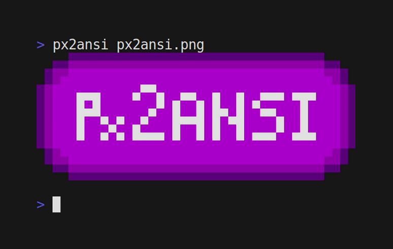

<br>
<p align="center">

</p>
<h3 align="center">Convert Pixel Art image to Text Art !</h3>
<p align="center"><i>
For all your needs to print fancy pixel art to your terminal.
</i></p>

# About

This tool convert pixel art image to text art using ANSI escape codes.
Motivated by the discovery of [arttime](https://github.com/poetaman/arttime), and the desire to use
my own custom pixel arts with it.
I've searched for a good converter but didn't find what i was looking for so this was an opportunity
to make my own.

<p align="center">

</p>

Compatible with any terminal supporting 24-bit ANSI Escape code and unicode characters.

# Installation

Installation is not mandatory, if you want to use Px2ANSI without installation, see the Non-Install
Use below.

Px2ANSI isn't distributed with package managers, but fortunately, it is still very easy to install:
```
git clone https://github.com/Nellousan/px2ansi.git
cd px2ansi
pip3 install .
```

This will install Px2ANSI to your pip install path under the name `pta`.

# How to use

Basic usage:
```
pta your_image.png
```

This will print directly to the terminal, if you want to save it to a file you can use the `>`
redirection operator or use:
```
pta your_image.png -o your_file.txt
```

Once you saved the output to a file, no need to use Px2ANSI anymore, you can simply print the content 
of your file using `cat your_file.txt`, for example.\
<br>
More features to come.

# Non-Install Use

It is also possible to use Px2ANSI without installing it by running `px2ansi.py` like any other python
script.
First, be sure to have the dependencies installed:
```
pip3 install -r requirements.txt
```

Now, you can simply run `python3 px2ansi.py` just like yoo would do with `pta`. For example:
```
python3 px2ansi.py your_image.png
```

You can also move `px2ansi.py` somewhere else on your machine since it is a standalone script.

# Roadmap

- [ ] Add a feature for default background color
- [ ] Add support for transparent pixel (between 0-255 alpha)
- [x] Make a setup script for installation
- [ ] Make the first proper release

# License

Distributed under the GNU General Public License v3.0

# Contact

Twitter - [@Nellousan](https://twitter.com/Nellousan)\
Email - nellousan@hotmail.fr